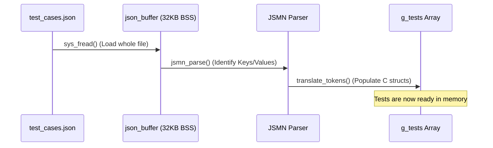
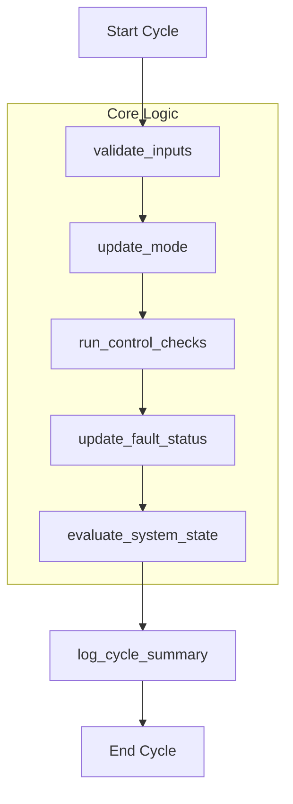

# ECU Simulator System Architecture

This document explains the end-to-end lifecycle of a simulation session, from parsing raw inputs to generating the final verification reports.

## 1. Data Flow & Input Parsing

The system uses a **Static Buffer Strategy** to comply with embedded safety standards (no `malloc`).

### Key Engineering Decision: The "Input Sentinel"
Because the JSON uses "Deltas," we use a special value (`-32768`) called `INPUT_SENTINEL`. 
- If the JSON specifies a value, we update the `active_input`.
- If the JSON is empty for that field, the ECU retains the previous value, simulating a real vehicle's persistence.

---

## 2. The Simulation Cycle (The "Heartbeat")

Every test cycle follows a deterministic MISRA-compliant execution order. This sequence ensures that I/O, Mode Logic, and Safety Checks never overlap in an undefined way.

### Module Responsibilities:
- **`validate_inputs`**: Clamps sensor noise to legal ranges.
- **`update_mode`**: Prevents illegal transitions (e.g. from OFF directly to IGNITION_ON).
- **`run_control_checks`**: The "Safety Layer" that detects physical conflicts (e.g. Speed > 0 in Park).
- **`update_fault_status`**: Handles fault counters (Persistence).
- **`evaluate_system_state`**: The High-Level arbiter that decides if the vehicle is in a SAFE state.

---

## 3. Telemetry & Reporting Engine

The system captures data at two different "velocities."

| Feature | Capture Method | Output File |
| :--- | :--- | :--- |
| **Functional Logs** | Streamed cycle-by-cycle during the loop | `log.txt` |
| **Logic Verification** | Snapshotted at the end of each Test Case | `integration_test_report.csv` |
| **Code Performance** | Averaged across thousands of CPU cycles | `code_performance_report.csv` |

### Measurement Integrity:
During performance measurement, the system uses the **`g_suppress_io`** flag. This disables console `printf` calls inside the core logic, ensuring that the logic timings represent only the CPU execution of your algorithms, not the slow speed of the terminal display.
